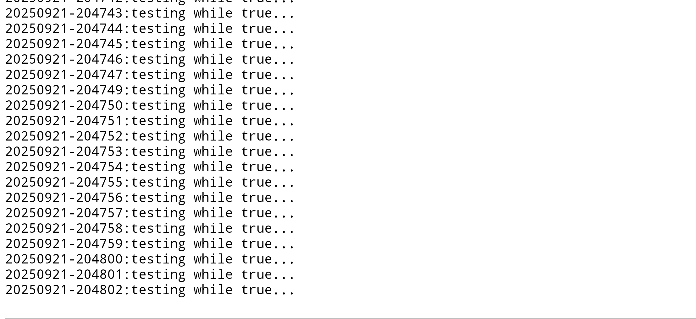

# UDisPlay
Using an old android/apple phone/tablet as a remote wifi text display for you ESP32 project.
## ESP32 side
Very easy.
### Choose the UDisPlay server IP and UDP port
```
UDisPlayStart("192.168.2.2", 4567); // IP is you display server 
```
### Compose your screen
Use the standard `sprintf` formatting.
The first lettre of the message is used as a header to modify the app behavior:
- `a` mean append like a logfile.
- `t` mean timed and add YYYYMMDD-hhmmss: at the beginning of each message before acting like a logfile too.
- `w` mean washed and clear the screen.
```
  // UDP packet up to 1460 should'nt be fragmented
  UDisPlayFill( "wLabore ipsum ut lorem magna sit. Ea ex ea elit dolor commodo consequat dolor ipsum ipsum ut labore labore aliqua. Do exercitation commodo tempor ad nisi ex magna elit. Enim ullamco tempor quis consectetur lorem dolore. Magna exercitation ad enim eiusmod nostrud ex exercitation sed. Ut commodo ullamco minim dolor aliqua commodo. Eiusmod consequat lorem aliqua dolor ullamco nisi ut aliquip dolor consequat laboris consequat et. Consectetur commodo amet commodo minim quis quis ipsum dolore incididunt minim. Ut nisi ipsum adipiscing et aliquip ut lorem laboris ipsum aliquip incididunt. Ipsum tempor exercitation exercitation ullamco labore ut ea enim quis adipiscing ut lorem.\nBOOTED SINCE %.4u\nsed labore enim dolore ut enim laboris veniam aliquip. Ad ipsum sit elit aliqua consectetur ut do laboris enim commodo elit lorem. Ad adipiscing sed magna consectetur laboris dolor tempor nostrud consectetur dolor veniam. Dolor minim sed magna labore laboris. Minim aliquip adipiscing sed do laboris. Lorem dolore dolore quis et enim ullamco sit exercitation ut ut elit. Enim sit ut quis magna ut. Ullamco quis ut minim eiusmod minim do ut ad ut nisi. Labore commodo elit ipsum tempor sed lorem. Nostrud magna aliqua exercitation do exercitation sit magna ea dolore ad ea adipiscing minim. Ex adipiscing enim do eiusmod ullamco labore laboris ex adipiscing ea adipiscing dolor. Amet veniam ipsum amet laboris ut ullamco adipiscing lorem. Ex enim dolor nostrud ip", milli()/1000 );
```
### Send the screen to the UDisPlay
```
  UDisPlaySend();
```

## UDisPlay Andriod apps
Apps are tested on Samsung S24 Android 15, Samsung Galaxy Tab 8.9 Android 4.0.4, 
### Classic text screen
https://github.com/defdefred/UDisPlay/raw/288cc2d111cfe670486416141a3e7bf02fac7c6e/apk/UDisPlay.apk
Timed example


## UDisplay Apple apps
I don't have any iphone for testing the apps...
